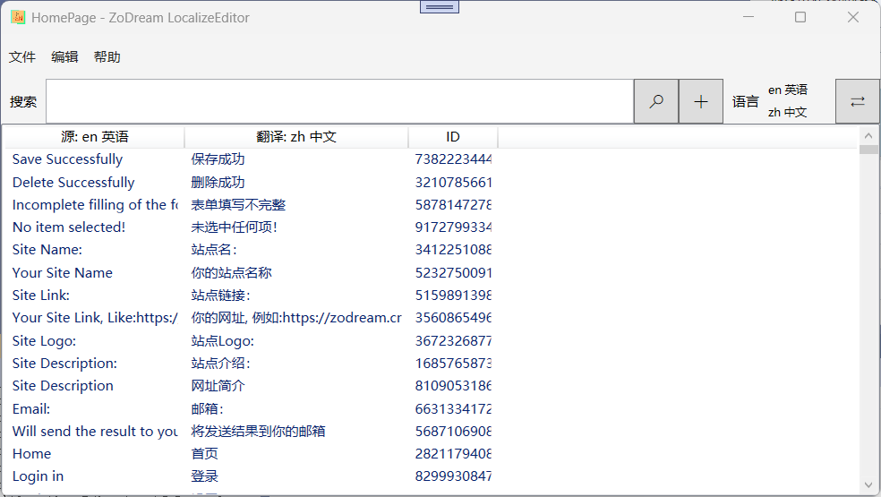
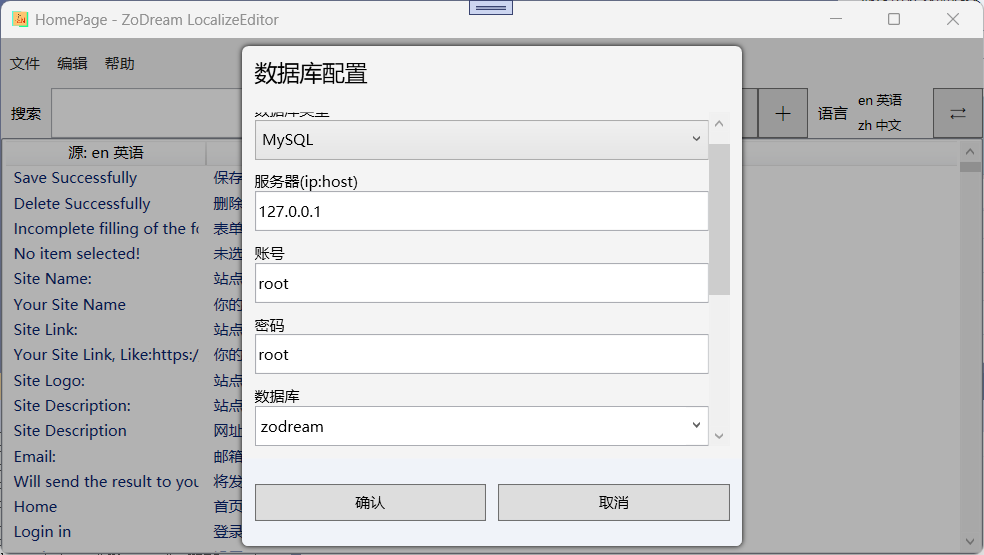
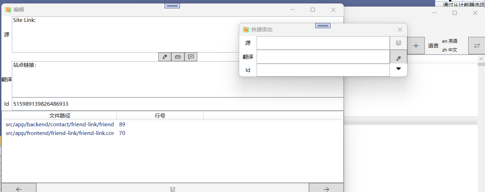

# Localize Editor
 suport json、xlf、resw、resx、po、mo etc

## 已实现功能

1. json 文件的读写
2. xlf 文件的读写
3. resx 文件的读写
4. po 文件的读写
5. mo 文件的读写
6. PHP 文件读写
7. 部分字幕、歌词（srt,lrc）文件读写
8. 支持mysql数据库读写
9. 翻译API 配置及调用，单个翻译，支持主流翻译API：Bing、Google、DeepL、百度、有道、阿里巴巴
10. 支持内嵌浏览器免费翻译
11. 支持全部翻译，或从选中地方开始部分翻译（仅支持浏览器）
12. 手动实现更改当前翻译作为源参照物

## 待实现功能

1. 从文件夹中提取需要翻译的文本
2. 有些文件的语言是写在文件路径里的，例如：message.en.json, en.json, en/message.json  这类语言是否需要指定提取？
3. 有些文件是只有 id 和 对应的 翻译, 是否需要 自动适配并保留显示到下一个语言包中，

例如： en.json, 'id' => 'it is wrong'; 

zh.json 'id' => '出错了', 

需要显示成 
|源: en| 翻译: zh| Id|
|:---|:---|:---|
|it is wrong|出错了|id|

## 已知问题

1. 浏览器翻译时，是通过监听翻译结果div内容变化自动提取的，但是如果翻译结果一样就没有变化，则无法获取，需要手动点击浏览器右上角获取

## 预览图

